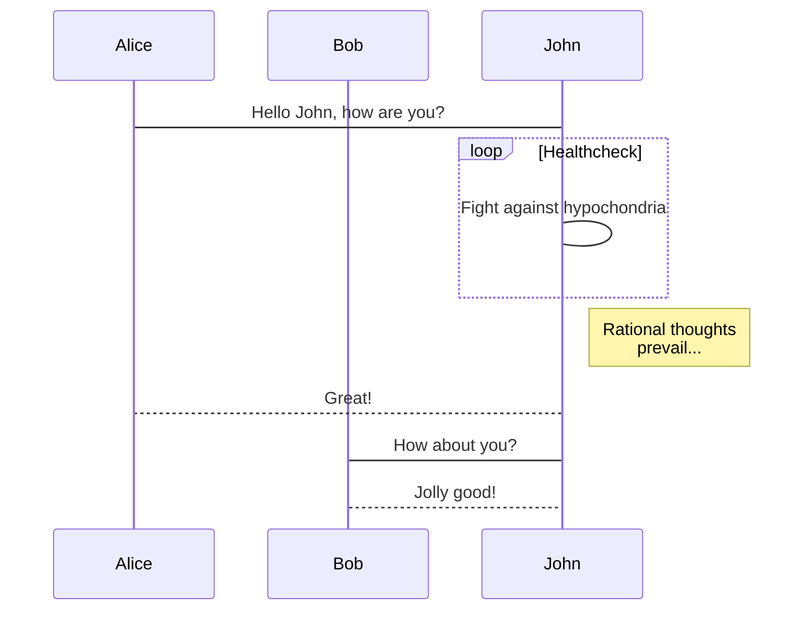
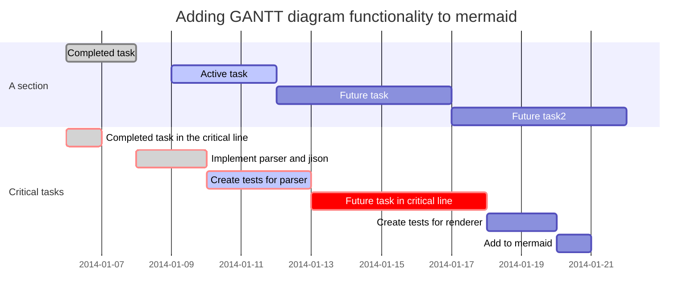

# 论文配图

<!-- @import "[TOC]" {cmd="toc" depthFrom=1 depthTo=6 orderedList=false} -->

<!-- code_chunk_output -->

* [论文配图](#论文配图)
	* [流程图](#流程图)
	* [时序图](#时序图)
	* [Mermaid渲染](#mermaid渲染)
	* [论文配图](#论文配图-1)
		* [提取主颜色流程](#提取主颜色流程)
		* [MVC架构时序](#mvc架构时序)
		* [采取成熟配色方案流程](#采取成熟配色方案流程)
		* [分享配色方案流程](#分享配色方案流程)

<!-- /code_chunk_output -->

[参考链接](https://www.jianshu.com/p/a9bd83b768d5)

## 流程图

```flow
//定义类型和描述
st=>start: 开始
e=>end: 结束
op=>operation: 我的操作
cond=>condition: 判断确认？
  
st->op->cond
cond(yes)->e
cond(no)->op
```
```
## 操作块(格式为:变量=>操作块: 备注名)
st=> start: 开始
e=>end: 结束
#普通操作块 opration
op1=>opration: 第一个操作块
op2=>opration: 第二个操作块
#判断块 condition
cond1=>condition: 第一个判断
cond2=>condition: 第二个判断
  
#输入输出块 inputoutput[平行四边形]
io1=>inputoutput: 输入输出块1
io2=>inputoutput: 输入输出块2
#子任务块
sub1=>subroutine: 子任务1
sub2=>subroutine: 子任务2
  
## 判断和位置控制
#判断流程控制
cond1(yes)->op1  #yes 的时候回到 op1
cond1(no)->e   #no 的时候 去结束
  
#位置指定
cond1(no)->op2(right)->op1 #控制 op2 位置置于右边，再由op2 返回 op1 (好像不能向左)
#还可以这样 cond1(no,right)
cond1(yes)->e 
  
## 流程控制
#分着写
st->op1
op1->e
  
#合着写
st->op1->e
  
#判断也是一样：
st->cond
cond(yes)->io
cond(no)->op1
```


```flow
st=>start: 鉴权
e=>end: 结束退出
cond1=>condition: user==bgbiao
product=ddaotian
productcheck=>condition: ddaotian类型产品库存
(ecs,bss,vpc,eip,hids)
  
  
op1=>operation: 发起预订请求
拆单并库存检测
  
op2=>operation: info:生产指定类型产品
(DAOTIAN:ecs,natip,eip,hids)
op3=>operation: 鉴权失败
op4=>operation: 库存检测失败
  
io1=>inputoutput: 返回产品相关信息
ECS,NATIP,EIP,HIDS
  
io2=>inputoutput: info:无此类型产品
  
  
  
st->cond1
cond1(yes)->op1->productcheck(yes)->op2->io1->e
cond1(no)->op3->e
cond1(yes)->op1->productcheck(no)->op4->io2->e
```

## 时序图

```sequence
bgbiao-> bianbian: good morning
note left of bgbiao: man
bianbian -> bgbiao: eat something
note right of bianbian: woman
  
note over bgbiao: test
```

## Mermaid渲染






## 论文配图

### 提取主颜色流程

```flow
st=>start: 开始
e=>end: 结束
op1=>operation: 选择图片
io1=>inputoutput: 像素取样 50x50
op2=>operation: 将RGB作为特征K-means聚类
op3=>operation: 获得中心点
op4=>operation: 选择距离中心最近的像素
st->op1->io1->op2->op3->op4->e
```
### MVC架构时序
```sequence
note left of 表现层: 用户操作
表现层--> 控制层: 用户请求
note over 控制层:  处理事件
控制层 -> 模型层: 选择调用接口，传入数据
note right of 模型层: 数据处理、存取
模型层 -> 控制层: 返回结果
控制层--> 表现层: 通知改变，跳转界面
note left of 表现层: 获得反馈
```

### 采取成熟配色方案流程

```flow
st=>start: 主页
cond=>condition: 是否需要检索？
io1=>inputoutput: 输入名称检索
op1=>operation: 浏览配色方案
op2=>inputoutput: 选取配色方案
op3=>operation: 进入详情页
op4=>inputoutput: 复制颜色数值
e=>end: 开始设计

st->cond
cond(yes)->io1->op2
cond(no)->op1
op1->op2->op3->op4->e
```

### 分享配色方案流程

```flow
st=>start: 主页
io1=>inputoutput: 点击取色页
io2=>inputoutput: 选取图片
cond1=>condition: 是否开启智能取色？
io3=>inputoutput: 选取颜色
op1=>operation: 生成配色方案
cond2=>condition: 是否符合预期？
cond3=>condition: 对方是否有本软件？
io4=>inputoutput: 保存色卡
io5=>inputoutput: 点击收藏页
io6=>inputoutput: 选取刚才的生产的配色方案
io7=>inputoutput: 点击分享图片或数值

e=>end: 结束

st->io1->io2->cond1
cond1(yes)->cond2
cond2(yes)->op1
cond2(no)->io3
cond1(no)->io3->op1
op1->io4->io5->io6->io7->e

```